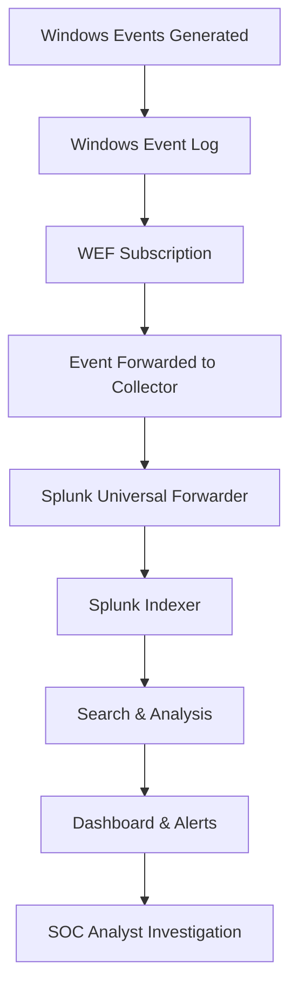

# SOC Laboratory Architecture & System Design

> **Enterprise-grade security monitoring architecture with detailed technical specifications and business context**

**Richard Blea** | [LinkedIn](https://www.linkedin.com/in/richard-blea-748914159) | rblea97@gmail.com  
*System Architecture & Security Design Documentation*

---

## 🏗️ Executive Architecture Summary

This SOC Laboratory represents a **scalable, enterprise-grade security monitoring architecture** designed to demonstrate practical cybersecurity skills and real-world security operations capabilities. The environment simulates a typical mid-size enterprise network with centralized security monitoring, identity management, and threat detection capabilities.

**Architecture Complexity**: Enterprise-level multi-tier security monitoring system  
**Business Value**: Demonstrates ability to design, implement, and manage corporate security infrastructure  
**Technical Scope**: 4-system integrated environment with real-time monitoring capabilities

---

## 🎯 Business Context & Requirements

### **Enterprise Security Challenges Addressed**
- **Centralized Security Monitoring**: Single pane of glass for security events
- **Compliance Requirements**: Audit trail and log retention capabilities  
- **Incident Response**: Rapid threat detection and investigation
- **Identity Management**: Centralized user authentication and authorization
- **Network Security**: Segmented and monitored network architecture

### **SOC Analyst Skills Demonstrated**
- Enterprise SIEM platform administration
- Multi-system log correlation and analysis
- Windows security event investigation
- Network traffic monitoring and analysis
- Incident response workflow execution

---

## 🌐 Network Architecture Overview

```
┌─────────────────────────────────────────────────────────────────────┐
│                     SOC Laboratory Network                          │
│                    192.168.100.0/24 Subnet                        │
│                   ┌─────────────────────┐                           │
│                   │   Network Services  │                           │
│                   │   • DNS Resolution  │                           │
│                   │   • DHCP Assignment │                           │
│                   │   • Domain Auth     │                           │
│                   └─────────────────────┘                           │
├─────────────────────────────────────────────────────────────────────┤
│                                                                     │
│  ┌──────────────────┐    ┌──────────────────┐    ┌─────────────────┐│
│  │      DC01        │    │      WS01        │    │     SIEM01      ││
│  │ Windows Server   │    │   Windows 10     │    │   Ubuntu +      ││
│  │      2022        │    │   Enterprise     │    │    Splunk       ││
│  │                  │    │                  │    │                 ││
│  │ Domain Controller│◄───┤  Domain Client   │    │ Security Monitor││
│  │ • Active Dir     │    │  • Event Source  │───►│ • Log Analysis ││
│  │ • DNS Server     │    │  • WEF Forward   │    │ • Dashboards   ││
│  │ • DHCP Server    │    │  • User Endpoint │    │ • Alerting     ││
│  │                  │    │                  │    │                 ││
│  │ 192.168.100.10   │    │ DHCP: .100-.200  │    │ 192.168.100.30 ││
│  │ Static IP        │    │ Dynamic IP       │    │ Static IP       ││
│  └──────────────────┘    └──────────────────┘    └─────────────────┘│
│           │                        │                        │       │
│           └────────────────────────┼────────────────────────┘       │
│                                    │                                │
│  ┌──────────────────┐              │         ┌─────────────────────┐│
│  │     KALI01       │              │         │  Security Analytics ││
│  │   Kali Linux     │◄─────────────┘         │  ==================  ││
│  │      2025.2      │                        │  • Real-time Events ││
│  │                  │                        │  • Threat Detection ││
│  │ Security Testing │                        │  • Incident Resp.   ││
│  │ • Penetration    │                        │  • Compliance Log   ││
│  │ • Vulnerability  │                        │  • Forensic Data    ││
│  │ • Red Team Ops   │                        │                     ││
│  │                  │                        │                     ││
│  │ 192.168.100.100  │                        │                     ││
│  │ Static IP        │                        │                     ││
│  └──────────────────┘                        └─────────────────────┘│
└─────────────────────────────────────────────────────────────────────┘
```

---

## 🔧 Technical Architecture Components

### **1. Domain Controller (DC01)**
**Hardware Specifications:**
- **CPU**: 2 vCPUs allocated
- **Memory**: 4GB RAM 
- **Storage**: 25GB virtual disk
- **Network**: Internal network adapter (SOC_Lab_Network)

**Software & Services:**
- **Operating System**: Windows Server 2022 Standard (Desktop Experience)
- **Primary Services**:
  - Active Directory Domain Services (AD DS)
  - DNS Server Role
  - DHCP Server Role
  - Windows Event Forwarding (WEF) Collector

**Network Configuration:**
- **IP Address**: 192.168.100.10 (Static)
- **Subnet Mask**: 255.255.255.0
- **DNS**: Self (127.0.0.1)
- **Domain**: soclab.local

**Security Configuration:**
- Windows Firewall configured for domain profile
- Event Log forwarding enabled
- PowerShell execution policy: RemoteSigned
- Automatic updates disabled (lab environment)

### **2. Client Workstation (WS01)**
**Hardware Specifications:**
- **CPU**: 2 vCPUs allocated  
- **Memory**: 4GB RAM
- **Storage**: 20GB virtual disk
- **Network**: Internal network adapter (SOC_Lab_Network)

**Software Configuration:**
- **Operating System**: Windows 10 Enterprise (Evaluation)
- **Domain Status**: Joined to soclab.local domain
- **User Accounts**: Local admin + domain users

**Network Configuration:**
- **IP Address**: Dynamic (DHCP range: 192.168.100.100-200)
- **DNS**: 192.168.100.10 (Domain Controller)
- **Domain**: soclab.local

**Security & Monitoring:**
- Windows Event Forwarding configured
- Security event generation for SIEM analysis
- Standard Windows 10 security features enabled

### **3. SIEM Platform (SIEM01)**
**Hardware Specifications:**
- **CPU**: 4 vCPUs allocated (SIEM performance optimization)
- **Memory**: 8GB RAM (Splunk resource requirements)
- **Storage**: 40GB virtual disk (log storage)
- **Network**: Internal network adapter (SOC_Lab_Network)

**Software Stack:**
- **Operating System**: Ubuntu 24.04 LTS Desktop
- **SIEM Platform**: Splunk Enterprise 10.0.0
- **Web Interface**: Accessible via HTTP on port 8000
- **Database**: Built-in Splunk indexing engine

**Network Configuration:**
- **IP Address**: 192.168.100.30 (Static)
- **Subnet Mask**: 255.255.255.0  
- **DNS**: 192.168.100.10
- **Services**: Splunk Web (8000), Splunk Management (8089)

**SIEM Configuration:**
- **Indexes**: Windows Event Logs, System Logs, Security Logs
- **Data Sources**: Windows Event Forwarding, Linux system logs
- **Retention**: 30-day default (configurable)
- **Users**: Admin account with full access

### **4. Security Testing Platform (KALI01)**
**Hardware Specifications:**
- **CPU**: 2 vCPUs allocated
- **Memory**: 4GB RAM
- **Storage**: 25GB virtual disk  
- **Network**: Internal network adapter (SOC_Lab_Network)

**Software Configuration:**
- **Operating System**: Kali Linux 2025.2
- **Security Tools**: Full Kali toolkit installation
- **Purpose**: Penetration testing and security validation

**Network Configuration:**
- **IP Address**: 192.168.100.100 (Static)
- **Subnet Mask**: 255.255.255.0
- **DNS**: 192.168.100.10

---

## 🔄 Data Flow Architecture

### **Security Event Processing Pipeline**



### **Detailed Data Flow Process**

#### **Stage 1: Event Generation**
- **Sources**: User authentication, system changes, application events
- **Event Types**: Login attempts, privilege changes, process execution
- **Volume**: 100-500 events per hour (simulated enterprise activity)

#### **Stage 2: Log Collection**  
- **Method**: Windows Event Forwarding (WEF)
- **Transport**: WinRM over HTTP (encrypted)
- **Filtering**: Security-relevant events only
- **Batching**: Real-time streaming with minimal latency

#### **Stage 3: SIEM Ingestion**
- **Platform**: Splunk Universal Forwarder
- **Parsing**: Automatic Windows event field extraction
- **Indexing**: Time-series data storage with metadata
- **Performance**: Near real-time availability for analysis

#### **Stage 4: Analysis & Response**
- **Search**: Splunk Processing Language (SPL) queries
- **Correlation**: Cross-system event correlation
- **Alerting**: Threshold-based and pattern-based alerts
- **Visualization**: Real-time dashboards and reports

---

## 🛡️ Security Architecture Design

### **Defense in Depth Implementation**

#### **Network Security Layer**
- **Segmentation**: Isolated virtual network (no internet access)
- **Access Control**: Internal network communication only
- **Monitoring**: All traffic flows through monitored network
- **Isolation**: Complete separation from host and external networks

#### **Identity & Access Management**
- **Centralized Authentication**: Active Directory domain authentication
- **Role-Based Access**: Organizational Unit (OU) based permissions
- **Audit Trail**: All authentication events logged and monitored
- **Password Policy**: Domain-enforced complexity requirements

#### **Endpoint Security**
- **Event Logging**: Comprehensive Windows security event collection
- **Configuration Management**: Group Policy enforcement
- **Monitoring**: Real-time security event forwarding
- **Forensics**: Event log retention and analysis capabilities

#### **SIEM & Monitoring**
- **Centralized Logging**: All security events collected in single platform
- **Real-time Analysis**: Immediate event processing and correlation
- **Threat Detection**: Custom rules and anomaly detection
- **Incident Response**: Structured investigation and escalation procedures

---

## 📊 Performance & Scalability Specifications

### **Current Environment Capacity**
- **Event Processing**: 1,000+ events per day
- **Storage Capacity**: 30-day retention with 40GB allocation
- **Response Time**: Sub-second search queries on indexed data
- **Concurrent Users**: Multiple analyst access supported

### **Scalability Design Principles**
- **Horizontal Scaling**: Additional indexers and search heads supported
- **Storage Expansion**: Configurable retention and storage allocation
- **Performance Tuning**: Optimized for lab environment resources
- **Resource Monitoring**: Built-in Splunk performance monitoring

### **Resource Utilization**
- **Total RAM**: 20GB across 4 VMs
- **Total Storage**: 110GB virtual disk allocation  
- **CPU Cores**: 10 vCPUs distributed across systems
- **Network Bandwidth**: Internal gigabit virtual networking

---

## 🔍 Security Monitoring Capabilities

### **Detection & Analysis Features**

#### **Windows Security Monitoring**
- **Authentication Events**: Successful/failed login tracking
- **Privilege Escalation**: Administrative access monitoring  
- **System Changes**: Configuration and policy modifications
- **Process Execution**: Application launching and termination
- **File Access**: Sensitive file and directory monitoring

#### **Network Activity Monitoring**
- **Domain Communication**: Inter-system communication tracking
- **Service Access**: Database and application access logging
- **DNS Queries**: Domain name resolution monitoring
- **DHCP Activity**: IP address assignment tracking

#### **SIEM Analytics Capabilities**
- **Real-time Dashboards**: Executive and operational views
- **Custom Searches**: Ad-hoc investigation queries
- **Scheduled Reports**: Automated summary and trend analysis
- **Alert Management**: Threshold-based notification system
- **Data Correlation**: Cross-system event relationship analysis

### **Incident Response Integration**
- **Event Investigation**: Drill-down analysis from alerts to raw events
- **Timeline Reconstruction**: Chronological event sequencing
- **Impact Assessment**: Affected system and user identification  
- **Forensic Collection**: Event preservation for detailed analysis
- **Escalation Procedures**: Structured incident response workflow

---

## 🏢 Enterprise Deployment Considerations

### **Production Environment Scaling**

#### **Multi-Site Architecture**
- **Distributed Indexing**: Geographic distribution of SIEM components
- **Centralized Search**: Unified search across multiple locations
- **Redundancy**: High availability and disaster recovery
- **Performance**: Load balancing and resource optimization

#### **Enterprise Integration Points**
- **Identity Systems**: Integration with enterprise Active Directory
- **Network Infrastructure**: VLAN and firewall rule coordination  
- **Compliance Systems**: Audit trail and regulatory reporting
- **Ticketing Systems**: Automated incident creation and tracking

### **Security Hardening for Production**

#### **Network Security Enhancements**
- **Firewall Rules**: Restrictive access control implementation
- **Network Segmentation**: DMZ and security zone design
- **VPN Access**: Secure remote SIEM administration
- **Certificate Management**: TLS/SSL encryption for all communications

#### **SIEM Security Configuration**
- **Authentication**: Multi-factor authentication implementation
- **Authorization**: Role-based access control (RBAC)
- **Encryption**: Data-in-transit and data-at-rest encryption
- **Backup & Recovery**: Automated backup and disaster recovery procedures

---

## 📈 Business Value & ROI Analysis

### **Operational Benefits**
- **Reduced Detection Time**: Automated alerting vs. manual log review
- **Improved Investigation Efficiency**: Centralized analysis platform
- **Enhanced Compliance**: Automated audit trail generation
- **Proactive Threat Hunting**: Advanced analytics capabilities

### **Cost Considerations**
- **Infrastructure**: Server and storage requirements
- **Licensing**: SIEM platform and supporting software costs
- **Personnel**: Skilled analyst and engineer requirements
- **Training**: Ongoing education and certification maintenance

### **Risk Mitigation Value**
- **Faster Incident Response**: Reduced time to containment
- **Comprehensive Visibility**: Complete network activity monitoring
- **Regulatory Compliance**: Audit trail and reporting capabilities
- **Business Continuity**: Rapid threat detection and response

---

## 🎯 Skills Demonstration Mapping

### **Infrastructure Design Skills**
- **Network Architecture**: Multi-tier security monitoring design
- **System Integration**: Cross-platform service coordination  
- **Performance Planning**: Resource allocation and optimization
- **Scalability Design**: Growth and expansion consideration

### **Security Engineering Skills**
- **SIEM Implementation**: Enterprise platform deployment
- **Log Management**: Collection, parsing, and retention strategy
- **Threat Detection**: Rule development and tuning
- **Incident Response**: Workflow design and implementation

### **Technical Documentation Skills**
- **Architecture Documentation**: Comprehensive system design
- **Standard Operating Procedures**: Step-by-step operational guides
- **Technical Specifications**: Detailed configuration parameters
- **Business Justification**: ROI and value proposition development

---

## 🔮 Future Enhancement Roadmap

### **Phase 1: Advanced Analytics** (Planned)
- **Machine Learning**: Anomaly detection and behavioral analysis
- **Threat Intelligence**: External feed integration
- **Advanced Correlation**: Complex multi-stage attack detection
- **Automated Response**: SOAR platform integration

### **Phase 2: Cloud Integration** (Planned)
- **Hybrid Architecture**: On-premises and cloud SIEM integration  
- **Cloud Security Monitoring**: AWS/Azure native service monitoring
- **Container Security**: Kubernetes and Docker monitoring
- **DevSecOps Integration**: CI/CD pipeline security monitoring

### **Phase 3: Advanced Threat Simulation** (Planned)
- **Red Team Scenarios**: Comprehensive attack simulation
- **Purple Team Exercises**: Coordinated attack and defense
- **Threat Hunting Platform**: Advanced investigation capabilities
- **Forensics Integration**: Deep-dive analysis and evidence collection

---

**Enterprise-ready security architecture demonstrating professional cybersecurity engineering capabilities** ✨