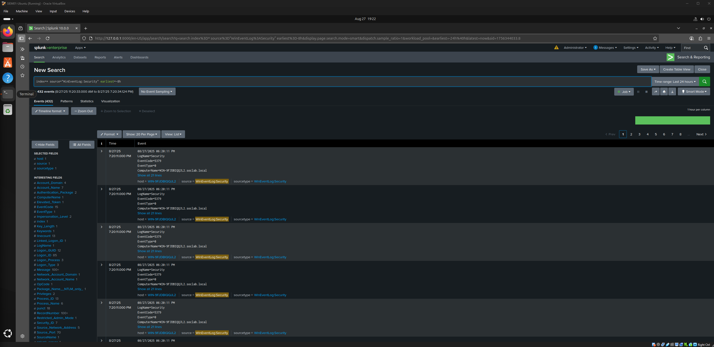
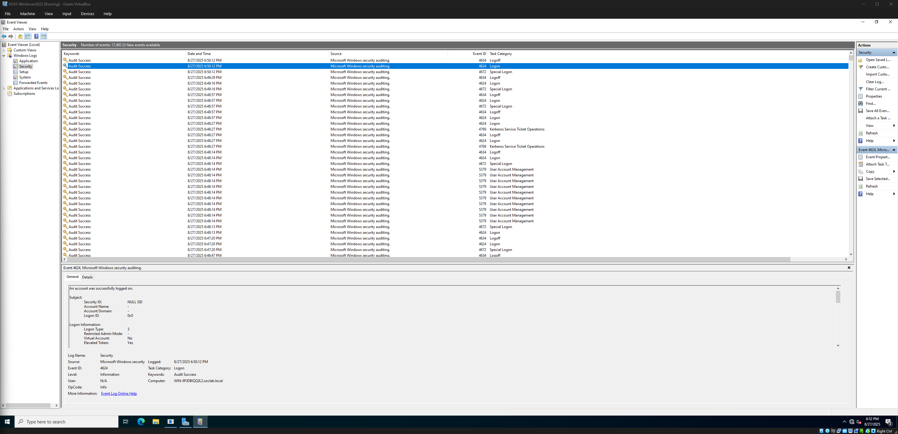
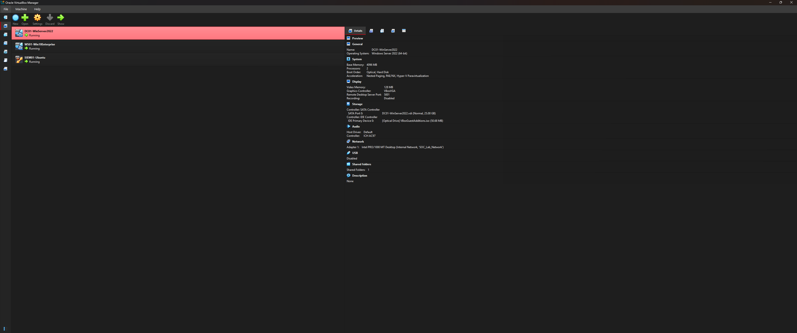

# Enterprise SOC Laboratory

[](https://opensource.org/licenses/MIT)
[](https://github.com/Rblea97/Enterprise-SOC-Laboratory)
[](https://github.com/Rblea97/Enterprise-SOC-Laboratory)
[](https://splunk.com)

A comprehensive Security Operations Center (SOC) laboratory environment designed for cybersecurity education, security operations training, and enterprise security monitoring simulation.


*Real-time security event analysis in Splunk Enterprise showing Windows authentication events*

## 🎯 Project Overview

This project demonstrates the implementation of an enterprise-grade security monitoring infrastructure using virtualization technology. The lab environment provides hands-on experience with real SOC operations including threat detection, incident response, and security event analysis.

### 🛡️ Current Implementation Status

**✅ Completed:**
- **Enterprise Domain Environment** - Windows Server 2022 DC with DNS/DHCP
- **Client Integration** - Windows 10 domain-joined workstation  
- **SIEM Platform** - Splunk Enterprise installation and configuration
- **Log Collection** - Windows Event Forwarding to Splunk
- **Basic Analysis** - Security event search and investigation capabilities

**🚧 In Development:**
- **Custom Dashboards** - Executive and operational security dashboards
- **Automated Alerting** - Real-time threat detection and notification
- **Attack Simulation** - Kali Linux red team scenarios
- **Advanced Analytics** - Correlation rules and behavioral detection
- **Playbook Integration** - Standardized incident response procedures

### 🏗️ Current Laboratory Architecture

```
┌─────────────────┐    ┌─────────────────┐    ┌─────────────────┐
│   DC01-Server   │    │   WS01-Client   │    │  SIEM01-Ubuntu  │
│  Windows 2022   │    │  Windows 10 Ent │    │   Splunk SIEM   │
│  192.168.100.10 │    │   DHCP Client   │    │ 192.168.100.30  │
│                 │    │                 │    │                 │
│ • Domain Ctrl   │    │ • Domain Joined │    │ • Log Ingestion │
│ • DNS Server    │◄──►│ • Event Source  │───►│ • Search Queries│
│ • DHCP Server   │    │ • WEF Configured│    │ • Basic Analysis│
└─────────────────┘    └─────────────────┘    └─────────────────┘

┌─────────────────┐
│   KALI01-Linux  │ 
│   Kali Linux    │    *Available for future attack simulation*
│ 192.168.100.100 │
│                 │
│ • Attack Tools  │
│ • Red Team Sim  │
└─────────────────┘
```

### 🔍 Security Monitoring Pipeline

```
Windows Events → WEF → Splunk Universal Forwarder → Splunk Enterprise → Analysis & Alerting
```

## 🚀 Quick Start Guide

### Prerequisites

- **Hardware Requirements:**
  - 16GB+ RAM (32GB recommended)
  - 500GB+ available disk space
  - Virtualization support (Intel VT-x/AMD-V)

- **Software Requirements:**
  - VirtualBox 7.0+ with Extension Pack
  - Windows Server 2022 ISO
  - Windows 10 Enterprise ISO
  - Ubuntu 22.04 LTS ISO

### Installation Steps

1. **Infrastructure Deployment**
   ```bash
   # Clone this repository
   git clone https://github.com/Rblea97/Enterprise-SOC-Laboratory.git
   cd Enterprise-SOC-Laboratory
   
   # Follow installation guides
   # See docs/installation/ for detailed instructions
   ```

2. **Domain Environment Setup**
   - Deploy Windows Server 2022 Domain Controller
   - Configure Active Directory domain (soclab.local)
   - Set up DNS and DHCP services
   - Join Windows 10 client to domain

3. **SIEM Platform Deployment**
   - Install Ubuntu Linux with Splunk Enterprise
   - Configure Windows Event Forwarding (WEF)
   - Set up Splunk Universal Forwarders
   - Verify log ingestion and create dashboards

4. **SOC Operations Activation**
   - Configure security monitoring rules
   - Set up automated alerting
   - Create investigation playbooks
   - Test incident response procedures

## 📊 Current Capabilities & Roadmap

### ✅ Currently Functional

| Component | Status | Description |
|-----------|--------|-------------|
| **Windows Domain** | ✅ Active | AD domain (soclab.local) with DNS/DHCP |
| **Windows Client** | ✅ Active | Domain-joined Windows 10 workstation |
| **Splunk SIEM** | ✅ Active | Enterprise installation with log ingestion |
| **Event Forwarding** | ✅ Active | WEF configured from Windows systems |
| **Basic Searches** | ✅ Active | SPL queries for security event analysis |
| **Kali Linux VM** | ✅ Available | Ready for attack simulation scenarios |

### 🚧 Development Roadmap

**Phase 2 (Next Implementation):**
- **Custom Dashboards** - SOC operations and executive views
- **Automated Alerting** - Real-time threat detection rules  
- **Attack Scenarios** - Kali Linux red team simulations
- **Investigation Templates** - Standardized analysis procedures

**Phase 3 (Future Enhancements):**
- **Advanced Analytics** - Behavioral detection and correlation
- **SOAR Integration** - Automated response capabilities
- **Threat Intelligence** - External feed integration
- **Cloud Monitoring** - AWS/Azure security integration

## 🛠️ Technology Stack

### Virtualization Platform
- **VirtualBox** - Free, cross-platform virtualization

### Operating Systems
- **Windows Server 2022** - Domain Controller, DNS, DHCP
- **Windows 10 Enterprise** - Domain client workstation
- **Ubuntu 22.04 LTS** - SIEM platform host

### Security Tools
- **Splunk Enterprise** - SIEM platform and log analysis
- **Windows Event Forwarding** - Centralized log collection
- **Splunk Universal Forwarder** - Log shipping agent
- **Active Directory** - Identity and access management

### Monitoring & Analysis
- **SPL (Splunk Search Processing Language)** - Advanced log queries
- **Custom Dashboards** - Real-time security metrics
- **Automated Alerting** - Threat detection and notification
- **Correlation Rules** - Multi-event attack detection

## 📈 Current Analysis Capabilities

### Available Security Monitoring
- **Authentication Events** - Login success/failure tracking
- **Administrative Activity** - Privileged account usage monitoring
- **System Events** - Service and system change detection
- **Event Correlation** - Basic multi-log source analysis via SPL queries

### Planned Metrics Framework
**Future Implementation:**
- **MTTD (Mean Time to Detection)** - Automated alert timing
- **MTTR (Mean Time to Response)** - Incident handling efficiency  
- **Alert Volume Management** - False positive reduction
- **Coverage Assessment** - Monitoring effectiveness measurement

### Dashboard Development Status
- **✅ Basic Splunk Interface** - Search and investigation capability
- **🚧 Custom Dashboards** - SOC operations views (planned)
- **🚧 Executive Reporting** - High-level security metrics (planned)
- **🚧 Real-time Monitoring** - Continuous threat detection (planned)

## 🎓 Learning Outcomes

### Technical Skills Developed
- **SIEM Administration** - Splunk deployment, configuration, optimization
- **Log Analysis** - Windows Event Log interpretation and correlation
- **Incident Response** - Complete IR lifecycle methodology
- **Threat Hunting** - Proactive security investigation techniques
- **Network Security** - Enterprise architecture and monitoring

### Professional Competencies
- **SOC Operations** - 24/7 monitoring and alert triage procedures
- **Security Analysis** - Threat pattern recognition and risk assessment
- **Technical Documentation** - Professional procedure and playbook creation
- **Stakeholder Communication** - Executive reporting and technical briefings

## 📸 Screenshots & Visual Documentation

### Live SOC Operations

*Windows Security Event Logs showing authentication events and audit trail*


*Enterprise laboratory infrastructure with dedicated VM resources*

**[View Complete Screenshot Gallery →](images/)**

## 📚 Documentation

### 📖 User Guides
- [**Installation Guide**](docs/installation/) - Complete setup instructions
- [**Operations Manual**](docs/operations/) - Daily SOC procedures
- [**Security Notice**](docs/SECURITY-NOTICE.md) - Important security guidelines
- **Architecture Guide** - System design documentation (planned)
- **Troubleshooting Guide** - Common issues and solutions (planned)

### 📋 SOC Procedures
- [**Playbooks**](soc-operations/playbooks/) - Incident response procedures
- [**Investigation Templates**](soc-operations/investigation-templates/) - Standardized investigation forms
- [**Alert Rules**](soc-operations/alert-rules/) - Custom detection configurations

### 🔍 Threat Hunting Resources
- [**Hunting Queries**](threat-hunting/hunting-queries/) - Pre-built search queries
- [**Detection Rules**](threat-hunting/detection-rules/) - Custom threat detection logic
- [**Threat Intelligence**](threat-hunting/threat-intelligence/) - IOC lists and threat data

## 🚀 Advanced Features (Planned)

- [ ] **Kali Linux Attack Platform** - Red team simulation capabilities
- [ ] **SOAR Integration** - Security orchestration and automated response
- [ ] **Cloud Security Monitoring** - AWS/Azure security integration
- [ ] **Container Security** - Docker/Kubernetes monitoring
- [ ] **Machine Learning Detection** - Advanced behavioral analytics
- [ ] **Threat Intelligence Feeds** - External threat data integration

## 🤝 Contributing

Contributions welcome! Please read our contributing guidelines and submit pull requests for:
- Additional playbooks and procedures
- Enhanced detection rules and queries  
- Documentation improvements
- New training scenarios

## 📞 Contact & Support

**Richard Blea**  
SOC Operations Specialist | Cybersecurity Student  
📧 rblea97@gmail.com  
💼 [LinkedIn](https://www.linkedin.com/in/richard-blea-748914159/)  
🎓 University of Colorado Denver - Computer Science & Cybersecurity

## 📄 License

This project is licensed under the MIT License - see the [LICENSE](LICENSE) file for details.

## 🙏 Acknowledgments

- **SANS Institute** - SOC methodology and best practices
- **Splunk Community** - SIEM configuration and optimization guidance
- **NIST Cybersecurity Framework** - Risk management and control guidance
- **CIS Controls** - Security configuration benchmarks

---

⭐ **Star this repository if it helped you learn SOC operations!**

*Built for educational purposes and professional cybersecurity development.*