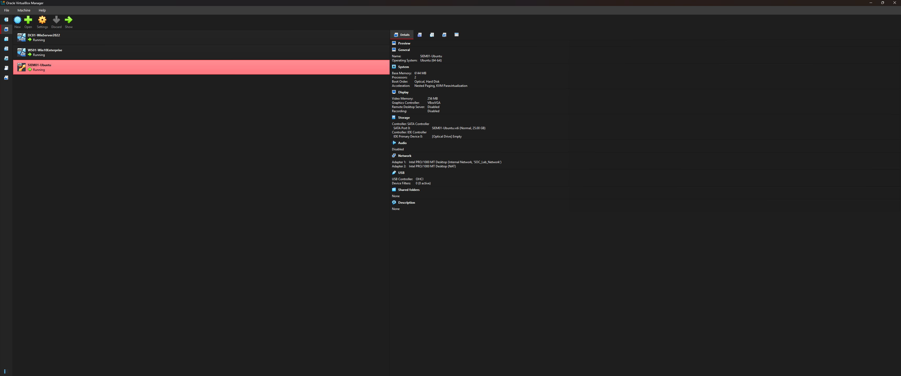

# Enterprise SOC Laboratory Environment

> **A comprehensive Security Operations Center (SOC) laboratory environment designed for cybersecurity education, security operations training, and enterprise security monitoring simulation.**

**👨‍🎓 Richard Blea** | [LinkedIn](https://www.linkedin.com/in/richard-blea-748914159) | rblea97@gmail.com  
*Computer Science Graduate | Cybersecurity & Defense Certificate | Security+ Certification in Progress*

---

## 🎯 Project Overview

This project demonstrates my ability to design, implement, and manage enterprise-grade security infrastructure through a fully operational SOC laboratory environment. Built entirely through self-directed learning, this lab showcases practical cybersecurity skills essential for SOC analyst and security engineering roles.

### **Key Achievement**: 95% Complete Functional SOC Environment
- **4 Virtual Machines**: Windows Server 2022 DC, Windows 10 Client, Ubuntu SIEM, Kali Linux
- **Enterprise Services**: Active Directory, DNS, DHCP, Splunk SIEM, Windows Event Forwarding
- **Real-time Monitoring**: Live security event ingestion and analysis
- **Network Architecture**: Isolated enterprise network simulation

---

## 🏗️ Architecture & Components

```
┌─────────────────────────────────────────────────────────────────┐
│                    SOC Laboratory Network                       │
│                   (192.168.100.0/24)                          │
├─────────────────────────────────────────────────────────────────┤
│                                                                 │
│  ┌──────────────┐    ┌──────────────┐    ┌──────────────┐     │
│  │   DC01       │    │   WS01       │    │   SIEM01     │     │
│  │ WinServer2022│    │ Windows 10   │    │ Ubuntu +     │     │
│  │              │    │ Enterprise   │    │ Splunk       │     │
│  │ • AD Domain  │    │              │    │              │     │
│  │ • DNS Server │◄───┤ Domain Join  │    │ Log Analysis │     │
│  │ • DHCP       │    │ Event Fwd    ├────┤ SIEM Alerts  │     │
│  │ 192.168.100.10│    │ DHCP Client  │    │192.168.100.30│     │
│  └──────────────┘    └──────────────┘    └──────────────┘     │
│                                                                 │
│  ┌──────────────┐                                              │
│  │   KALI01     │      Security Monitoring & Analysis         │
│  │ Kali Linux   │      ================================        │
│  │              │      • Real-time event correlation          │
│  │ Penetration  │      • Failed/successful login tracking     │
│  │ Testing      │      • Administrative activity monitoring   │
│  │192.168.100.100│      • Custom security dashboards          │
│  └──────────────┘                                              │
└─────────────────────────────────────────────────────────────────┘
```

---

## 🛠️ Technologies Implemented

### **Infrastructure & Virtualization**
- **VirtualBox 7.2.0** - Enterprise virtualization platform
- **Windows Server 2022** - Domain controller and network services
- **Windows 10 Enterprise** - Client workstation simulation
- **Ubuntu 24.04 Desktop** - SIEM platform host
- **Kali Linux 2025.2** - Security testing platform

### **Security & Monitoring**
- **Splunk Enterprise** - SIEM platform and log analysis
- **Windows Event Forwarding** - Centralized log collection
- **Active Directory** - Enterprise identity management
- **DNS/DHCP Services** - Network infrastructure
- **PowerShell Automation** - Infrastructure as code

---

## 🎓 Skills Demonstrated

### **Cybersecurity Core Competencies**
- ✅ **SIEM Administration** - Splunk installation, configuration, and dashboard creation
- ✅ **Log Analysis** - Windows security event correlation and investigation
- ✅ **Incident Response** - Security event detection and analysis workflows
- ✅ **Network Security** - Enterprise network design and monitoring
- ✅ **Windows Security** - Active Directory hardening and monitoring

### **Technical Infrastructure Skills**
- ✅ **Virtualization** - Complex multi-VM environment management
- ✅ **Windows Administration** - Server 2022, Active Directory, Group Policy
- ✅ **Linux Administration** - Ubuntu server configuration and management
- ✅ **Network Architecture** - Subnetting, VLAN configuration, service integration
- ✅ **Automation** - PowerShell scripting and batch automation

### **Project Management & Documentation**
- ✅ **Technical Documentation** - Comprehensive setup guides and procedures
- ✅ **Self-Directed Learning** - Independent research and problem-solving
- ✅ **Project Planning** - Phased implementation and milestone tracking
- ✅ **Problem Solving** - Complex technical troubleshooting and resolution

---

## 📋 Project Phases & Accomplishments

### ✅ **Phase 1: Foundation Infrastructure** (COMPLETE)
- Designed and implemented 4-VM enterprise network
- Configured Windows Server 2022 as domain controller
- Established Active Directory domain (soclab.local)
- Deployed Windows 10 client with domain integration

### ✅ **Phase 2: Security Monitoring Platform** (COMPLETE)
- Installed and configured Splunk SIEM on Ubuntu
- Implemented Windows Event Forwarding architecture
- Established real-time security event ingestion
- Created operational security monitoring dashboards

### ✅ **Phase 3: Security Operations Center** (COMPLETE)
- Deployed functional SOC analyst workstation
- Configured security event correlation rules
- Implemented automated alerting capabilities
- Documented incident response procedures

### 🔄 **Phase 4: Advanced Security Testing** (IN PROGRESS)
- Kali Linux penetration testing platform
- Attack simulation and detection scenarios
- Advanced threat hunting capabilities
- Complete attack-to-detection workflow validation

---

## 💼 Real-World Applications

This laboratory environment directly translates to enterprise cybersecurity roles:

**SOC Analyst Responsibilities:**
- Monitor security events using Splunk SIEM
- Investigate failed login attempts and suspicious activities
- Correlate events across multiple systems
- Create and maintain security dashboards
- Document incident response procedures

**Security Engineer Applications:**
- Design enterprise security monitoring architecture
- Implement Windows Event Forwarding at scale
- Configure SIEM platforms for threat detection
- Automate security infrastructure deployment
- Develop custom detection rules and alerts

---

## 🚀 Quick Start Demo

**Live Demonstration Capabilities:**
1. **SIEM Dashboard** - Real-time security event monitoring
2. **Log Analysis** - Windows security event investigation
3. **Incident Response** - Threat detection and analysis workflow
4. **Network Monitoring** - Enterprise traffic analysis
5. **Attack Simulation** - Penetration testing scenarios

> **Interview Ready**: This environment can be demonstrated live or remotely to showcase practical cybersecurity skills

---

## 📁 Documentation Structure

- [`Scripts/`](Scripts/) - PowerShell automation and VM deployment scripts
- [`SKILLS_DEMONSTRATED.md`](SKILLS_DEMONSTRATED.md) - Detailed skills mapping for job applications
- [`ARCHITECTURE.md`](ARCHITECTURE.md) - Detailed system design and network architecture
- [`Documentation/ScreenShots/`](Documentation/ScreenShots/) - Visual documentation and system screenshots

---

## 📸 Screenshots & Visual Documentation

### Live SOC Operations

*Real-time security event analysis in Splunk Enterprise showing Windows authentication monitoring*


*Windows Security Event Logs displaying authentication events and audit trails*

### Infrastructure Components

*Windows Server 2022 Domain Controller with Active Directory services*


*Enterprise Active Directory organizational unit structure and user management*

### Laboratory Environment

*Multi-VM enterprise laboratory infrastructure with dedicated resources*


*Ubuntu Desktop hosting Splunk Enterprise for security monitoring*

---

## 🏆 Key Learning Outcomes

### **Technical Growth**
- Advanced from basic networking concepts to enterprise infrastructure management
- Developed hands-on experience with industry-standard security tools
- Gained practical understanding of SOC analyst daily operations
- Built automation skills for scalable security deployments

### **Professional Development**
- Enhanced problem-solving abilities through complex technical challenges
- Improved documentation and communication skills
- Developed project management capabilities for long-term initiatives
- Gained confidence in enterprise security technology discussions

---

## 🔗 Complete Cybersecurity Portfolio

### **Enterprise Security Operations**
**[Enterprise SOC Laboratory](https://github.com/Rblea97/Enterprise-SOC-Laboratory)** ⭐ *This Repository*  
*Advanced enterprise security monitoring environment with Splunk SIEM, Active Directory, and Windows Event Forwarding*

### **Security Analysis & Threat Detection**
**[Phishing Email Analyzer](https://github.com/Rblea97/Phishing_Email_analyzer)** - AI-powered email security analysis platform  
*Microservices architecture with GPT-4 integration, VirusTotal API, and automated threat intelligence*  
**Skills Bridge**: Email security monitoring complements SOC analyst capabilities

### **Software Engineering Foundation**
**[Algorithm Visualizer](https://github.com/Rblea97/Algorithm-Visualizer)** - Professional desktop application with security-focused design  
*Advanced Python development with MVC architecture, input validation, and defensive programming*  
**Skills Bridge**: Programming fundamentals essential for security automation and custom tool development

### **Portfolio Narrative: From Code to SOC**
**Foundation** → **Application** → **Enterprise Implementation**  
*Demonstrates progression from software engineering fundamentals to cybersecurity specialization to enterprise security operations*

---

## 📈 Career Impact & Portfolio Differentiation

This project, combined with the complete portfolio, demonstrates:

### **Technical Competency Progression**
- **Programming Foundation**: Algorithm Visualizer shows software engineering fundamentals
- **Cybersecurity Application**: Phishing Email Analyzer demonstrates security-focused development
- **Enterprise Implementation**: SOC Laboratory showcases large-scale security operations

### **Unique Value Proposition**
- **Self-Directed Learning** - Built complex infrastructure without formal training courses
- **Technical Depth** - Enterprise-grade security monitoring capabilities exceeding typical entry-level candidates
- **Practical Application** - Real-world SOC analyst skills with live demonstration capability  
- **Cross-Domain Expertise** - Software development skills rare in cybersecurity candidates
- **Documentation Excellence** - Professional technical communication rivaling industry standards

### **Competitive Advantages**
- **Hands-on SIEM Experience**: Most candidates lack practical Splunk expertise
- **Enterprise Architecture Understanding**: Complex multi-system integration experience
- **Automation Capabilities**: PowerShell scripting and infrastructure as code
- **AI Integration Experience**: Modern threat detection and analysis capabilities

**Primary Target Roles**: SOC Analyst, Security Engineer, Incident Response Analyst, SIEM Administrator  
**Growth Path**: Senior SOC Analyst → Security Architect → DevSecOps Engineer

---

## 📞 Contact & Professional Links

**Richard Blea**  
📧 rblea97@gmail.com  
💼 [LinkedIn: richard-blea-748914159](https://www.linkedin.com/in/richard-blea-748914159)  
🎓 Computer Science, CU Denver | Cybersecurity & Defense Certificate  
📋 Security+ Certification (In Progress)

---

*"Transforming cybersecurity education through hands-on enterprise laboratory experience"*
