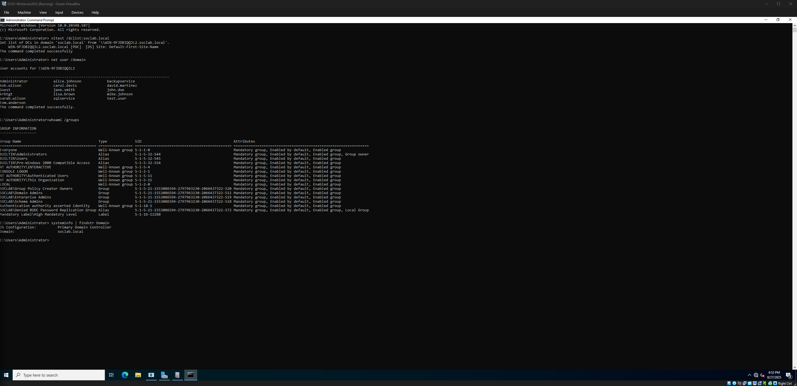
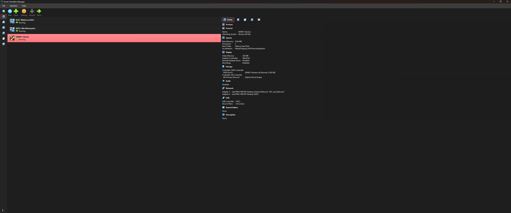
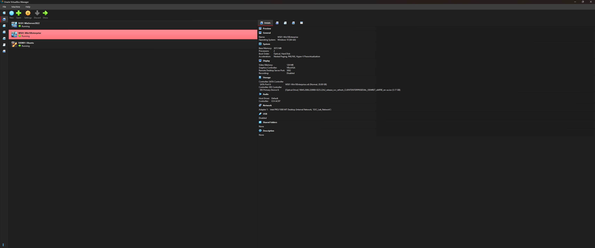
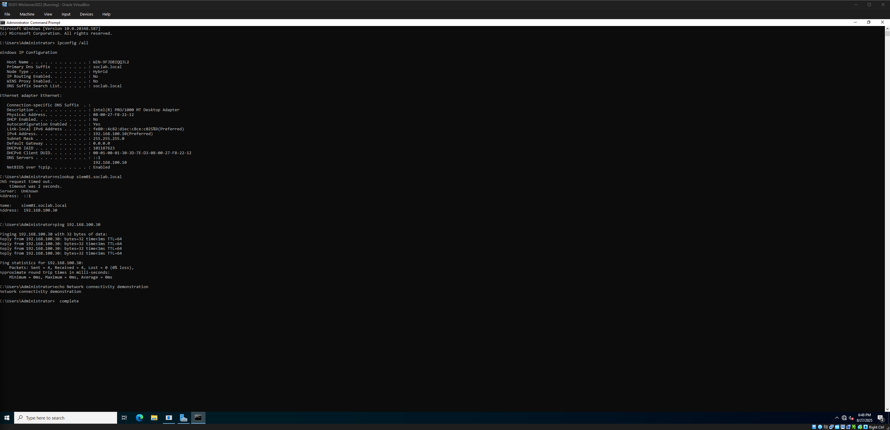

# SOC Laboratory Screenshots

Professional documentation of the Enterprise SOC Laboratory environment showcasing operational security monitoring capabilities.

---

## 🔍 **SIEM Operations**

### Splunk Enterprise Security Dashboard

*Real-time security event analysis showing Windows authentication events flowing from domain infrastructure into Splunk Enterprise SIEM platform. Search query demonstrates investigation of WinEventLog:Security events with 24-hour time range.*

**Key Features Demonstrated:**
- Active log ingestion from Windows Event Forwarding
- Professional SPL query syntax for security analysis  
- Real-time security event correlation and investigation
- Enterprise SIEM dashboard interface and analytics

---

## 🖥️ **Windows Security Monitoring**

### Windows Event Viewer - Security Logs

*Windows Security Event Log showing detailed authentication events including successful logins (Event ID 4624) with full user, domain, and logon type information. Demonstrates comprehensive Windows security logging and audit trail capabilities.*

**Security Events Captured:**
- User authentication and logon tracking
- Administrative account activity monitoring
- Security policy changes and audit events
- Integration with SIEM for centralized analysis

---

## 🏢 **Domain Infrastructure**

### Active Directory Management

*Command-line administration of Active Directory domain (soclab.local) showing user account management, group membership, and domain controller operations via PowerShell and net commands.*

**Enterprise Capabilities:**
- Centralized user and computer management
- Group Policy and organizational unit structure
- Domain authentication and access control
- Professional Windows Server administration

---

## 🖼️ **Virtual Infrastructure**

### VirtualBox Laboratory Environment

*VirtualBox infrastructure showing enterprise-grade virtual machine configuration with dedicated resources, network settings, and storage allocation for domain controller operations.*

**Infrastructure Highlights:**
- Professional virtualization with dedicated resources
- Isolated network configuration for security
- Enterprise-scale memory and storage allocation
- Multiple VM coordination and management

### Additional VM Screenshots
- **Ubuntu SIEM Platform**: 
- **Windows Client**: 
- **Domain Controller**: 

---

## 📊 **Technical Specifications Visible**

### Resource Allocation
- **Domain Controller**: 8GB RAM, VT-x/AMD-V acceleration
- **Network Configuration**: Host-only adapter for isolation
- **Storage**: Dynamic allocation with sufficient capacity
- **Integration**: Seamless VM-to-VM communication

### Security Monitoring Pipeline
1. **Windows Events** → Generated on domain systems
2. **Event Forwarding** → WEF configured for centralization  
3. **Splunk Ingestion** → Universal Forwarder pipeline
4. **Analysis Interface** → Real-time search and investigation
5. **Professional Documentation** → Complete audit trail

---

**Screenshots demonstrate operational SOC environment with real security monitoring capabilities suitable for enterprise cybersecurity training and professional development.**